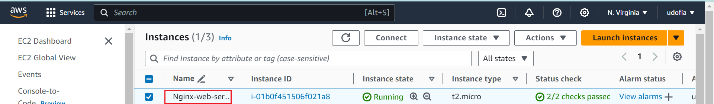
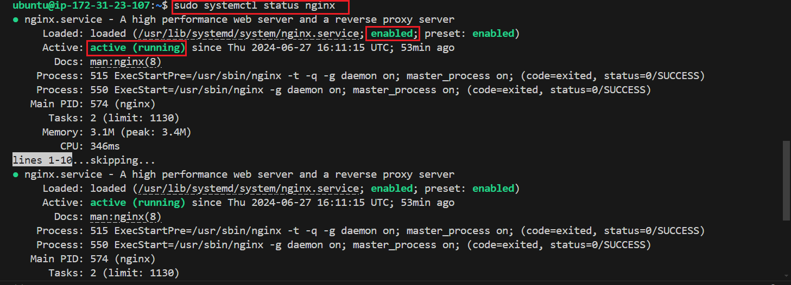

Static Website deployed on AWS Linux EC2 Instance


```
sudo apt update
sudo apt install nginx
sudo systemctl start nginx
sudo systemctl enable nginx
```


static website accessible using the ec2 public IP listening on HTTP port :80 
```
http://34.229.149.15/
```

